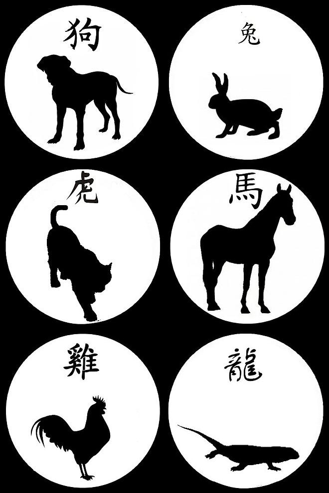

# Chinese Zodiac and Elemental Analysis

This Python script utilizes several modules to provide information about your Chinese zodiac sign, associated animals, and energetic elements based on your birth year.

## Prerequisites

Before running the script, ensure that you have Python installed on your machine. You can download and install Python from [python.org](https://www.python.org/downloads/).

## Getting Started

1. Clone the repository to your local machine:

```bash
git clone https://github.com/<your-username>/Chinese_Zodiac.git
```
2. Navigate to the project directory:

```bash
cd Chinese_Zodiac
```
3. Run the script:

```bash
python chinese_zodiac.py
```
## Usage

1. Enter your name when prompted.

2. Enter your birth year when prompted.

The script will provide information about your Chinese zodiac sign, associated animals, and energetic elements.

### Modules Used
1. zodiac: Contains functions for determining Chinese zodiac sign and associated animals.
2. images_results: Provides images related to the Chinese zodiac sign.
3. energetic_element: Calculates the fixed energetic element based on the birth year.
4. element: Calculates the elemental analysis based on the birth year.

#### Example:
```python
from zodiac import chinese_zodiac
from images_results import animal_images
from energetic_element import fixed_energetic_element
from element import calculate_element

name = input('What is your name? ')
year = int(input('What year were you born? '))

# Call the function
sign, best_animal, guardian_animals1, guardian_animals2, worst_animal, worse_animal = chinese_zodiac(year)
calculate_element(year)
animal_images(name, sign, best_animal, guardian_animals1, guardian_animals2, worst_animal, worse_animal)
```
#### Results:


```bash
What is your name? William   
What year were you born? 1994

Your zodiac animal is dog
The guardian animals are tiger and horse.
The best friend animal is rabbit.
The worse enemy animal is dragon.
The worst enemy animal is rooster.
Your element is wood
```


### Acknowledgments
The Chinese zodiac data is sourced from traditional Chinese astrology.
Feel free to customize and improve upon this script as needed!
